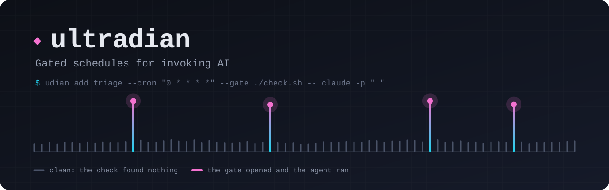

<p align="center"></p>

# Ultradian

Gated schedules and workflows for invoking AI. Ultradian runs cron loops on a machine, puts cheap deterministic checks in front of agent and LLM invocations, and records how every loop is going.

The name comes from ultradian rhythms, the cycles your body runs through many times a day, like the roughly 90 minute waves of focus and rest the brain moves through. That is the idea here: give a machine its own rhythms, recurring work it runs and keeps track of itself.

> Status: 0.x. The daemon, gates, runs and records work end to end and the run record is meant to stay stable, but commands and flags may still change before 1.0.

## The idea

Most scheduled agent automation wastes inference on polling. If you point an agent at "check Sentry every hour", it wakes up every hour, has a look around, and most of the time finds nothing. You are paying a model to work out there was nothing to do.

Ultradian flips the order. The schedule runs a cheap script first, and that script decides whether anything else needs to happen. Most ticks end right there, and the cost was running a script. When the gate does find something worth acting on, it hands that context to an agent invocation, whether that is Codex, Claude, or a custom harness you have set up.

The hourly Sentry check looks like this:

1. **Cron fires.** A small script pulls the last hour of errors.
2. **Nothing new.** The run records a clean pass and stops. No agent, no tokens.
3. **Something buggy.** The script bundles the error context and invokes an agent session with it, through whichever harness you have configured, to investigate and fix.

Ultradian owns the schedule, the gate, the invocation, and the record of what happened. It keeps enough visibility on an invocation to account for it: the session started, how it exited, how long it took. The work inside the session belongs to its harness.

The point is loop engineering. You build loops, stack loops on top of other loops, and see the health of all of it in one place.

### Building that loop

Gates are first class. A schedule holds two parts: a gate command and an action command. The gate speaks through its exit code and stdout:

- exit 0 with no stdout: clean pass, the action never runs;
- exit 0 with stdout: the gate opens, and that stdout is piped to the action's stdin as context;
- nonzero exit: gate failure, recorded, the action never runs.

So the gate script only has to decide and describe. Here is a rough sketch of `check-sentry.ts`, with made-up API shapes:

```ts
#!/usr/bin/env bun
// The gate: cheap, deterministic, no inference. Print nothing when all is
// well; print the context when something needs attention.
const response = await fetch(
  `${process.env.SENTRY_API}/issues/?statsPeriod=1h&query=is:unresolved`,
  { headers: { authorization: `Bearer ${process.env.SENTRY_TOKEN}` } }
);
const issues = (await response.json()) as Array<{
  title: string;
  count: number;
  permalink: string;
}>;

if (issues.length === 0) {
  process.exit(0);
}

const report = issues
  .map((issue) => `${issue.title} (${issue.count} events) ${issue.permalink}`)
  .join("\n");
console.log(`New Sentry issues appeared in the last hour:\n\n${report}`);
```

Schedule it with the agent invocation as the action, start the daemon, and watch the loop:

```bash
udian add sentry-check --cron "0 * * * *" \
  --gate "bun check-sentry.ts" \
  -- claude -p "Investigate the Sentry issues on stdin and open a fix PR if the cause is clear."
udian daemon start
udian list                # every schedule, next fire, last outcome
udian logs sentry-check   # every tick: mostly clean passes, occasionally a session
```

Most runs cost a single fetch and record a clean pass. The ones that matter walk into the session with the context already gathered, and either way every run leaves a record, so you can always see how the loop has been going.

## What it does

- **Schedules.** Cron expressions, fixed intervals, and manual triggers, owned by a lightweight local daemon.
- **Gates.** Cheap scripts run first and decide whether the expensive step happens at all.
- **Generic execution.** Any command can be scheduled, including agent invocations like `claude -p` or `codex exec`. The runner treats them all the same and records which executor ran.
- **One-shot jobs.** `once` hands a single command to the daemon and returns straight away with its identity. It runs under the same supervision, with the same timeout enforcement, and leaves the same kind of record.
- **Loop health.** Every run captures stdout, stderr, exit status, and timing, plus structured lifecycle events, under stable schedule and run identifiers, so you can see how a loop has been running over time.
- **Restart recovery.** The daemon persists state in SQLite and resumes after a restart without duplicating runs. A fire missed while it was down runs once within the schedule's catch-up window, or is recorded as missed.
- **Run control.** Timeouts and `cancel` end a run's whole process group, so nothing it started is left behind.
- **Composable output.** Every command speaks human, `--json`, and `--jsonl`. Other tools consume Ultradian by piping its output.

## How it works

A small daemon owns the schedules and runtime state, persisted in a local SQLite database. The CLI is the control surface that talks to it, rendering results for people and emitting envelopes for machines.

Every run produces a record that any other tool can consume:

```json
{
  "run_id": "run_0msgv8jw5gc3no3lrbu",
  "schedule_id": "schedule_0msgv3sh6aaqk2m4wvz",
  "schedule": "sentry-check",
  "machine_id": "casey-mbp",
  "executor": "claude",
  "trigger": "scheduled",
  "status": "succeeded",
  "gate_exit": 0,
  "action_exit": 0,
  "started_at": "2026-08-06T09:00:00.412Z",
  "finished_at": "2026-08-06T09:03:41.006Z",
  "log_pointer": "~/.ultradian/logs/sentry-check/2026-08-06/run_0msgv8jw5gc3no3lrbu.log"
}
```

A run's status tells the loop's story: `queued` (waiting for the daemon), `running`, `clean` (the gate closed), `succeeded` or `failed` (the action ran), `gate_failed`, `timed_out` (the action outlived the schedule's `--timeout` and its process group was killed), `canceled` (stopped with `cancel`), `skipped` (the previous run was still in flight), `missed` (a fire passed while the daemon was down and outside the schedule's `--catch-up` window), and `interrupted` (the owning process died mid-run). The `trigger` says where the fire came from: `scheduled` (the daemon reached the next fire), `manual` (`run`), or `once` (a one-shot job).

The record is the integration surface. Anything that wants to observe Ultradian or build on top of it consumes these records.

## Install

`ultradian` and the short alias `udian` are the same program. Each release has a build for macOS and Linux on arm64 and x64, with a `SHA256SUMS` file to check them against.

```bash
version=0.2.1
target=darwin-arm64   # or darwin-x64, linux-arm64, linux-x64
curl -fLO "https://github.com/aaronvanston/ultradian/releases/download/v$version/ultradian-$version-$target.tar.gz"
curl -fLO "https://github.com/aaronvanston/ultradian/releases/download/v$version/SHA256SUMS"
grep " ultradian-$version-$target.tar.gz$" SHA256SUMS | shasum -a 256 -c -
tar -xzf "ultradian-$version-$target.tar.gz"
./ultradian self install
```

`self install` copies the binary to `~/.ultradian/bin/udian`; put that folder on your `PATH`. To keep the daemon running across logins and crashes, register it with launchd or systemd:

```bash
udian daemon install
```

The service gets your login shell's `PATH`, so actions such as `claude` or `codex` are found; pass `--path` to set it yourself, or `--dry-run` to see the service file first. On Linux, run `loginctl enable-linger "$USER"` once so the service outlives your last login, SSH included. Upgrading is the same `self install` from a newer build, then `udian daemon restart`.

To run from source instead, with [Bun](https://bun.sh/):

```bash
git clone https://github.com/aaronvanston/ultradian.git
cd ultradian
bun install
bun link
```

## Set up

There is nothing to configure before first use. State lives in `~/.ultradian`: the SQLite database, the daemon log, and one log file per run. Set `ULTRADIAN_HOME` to relocate all of it.

Every run's output is kept in its own log, one file per run partitioned by day (`logs/<schedule>/<YYYY-MM-DD>/<run>.log`), capped at 10MB a run. The daemon removes runs and logs older than 30 days once a day; set `ULTRADIAN_RETENTION` to another age such as `90d`, or `off` to keep everything, and `prune --older-than 30d` reclaims space whenever you like. `doctor` reports how many runs are recorded and how much space the logs take. The daemon's own log rotates at 5MB, keeping three. The state folder and logs are readable only by you.

Configuration follows two rules:

- All environment variables use the `ULTRADIAN_` prefix.
- A local `.env` file works during development. Compiled binaries deliberately do not auto-load `.env`, so production configuration stays explicit.

## Use it

The command set:

```bash
ultradian add <name> --cron "0 * * * *" [--gate <cmd>] -- <command>   # schedule a loop
ultradian add <name> --cron "0 9 * * 1-5" --tz Europe/London -- <command>   # cron in a time zone
ultradian add <name> --every 15m --timeout 30m --catch-up 1h -- <command>   # interval, kill hung runs, catch up after downtime
ultradian add <name> --gate <cmd> --gate-mode exit -- <command>     # open the gate on exit 0 alone
ultradian add <name> --cwd <dir> --group <group> -- <command>       # where it runs, and a group heading
ultradian once [--name <label>] [--cwd <dir>] [--timeout <duration>] -- <command>   # run once under the daemon
ultradian list                                                      # schedules by group, next fire, last outcome
ultradian set <name> [--every 5m|--cron ...|--no-gate|...] [-- <command>]   # change any part in place
ultradian run <name> [--detach]                                     # fire now and wait, or queue it for the daemon
ultradian cancel <run_id>                                           # stop a queued or running run
ultradian status                                                    # daemon health and active runs
ultradian logs [name] [--run <id>]                                  # recent runs and captured output
ultradian runs [--since <cursor>]                                   # run records for other tools, oldest change first
ultradian pause <name> | --group <group>                            # stop triggering, keep the schedule
ultradian resume <name> | --group <group>                           # start triggering again
ultradian rm <name>                                                 # remove it, keeping run history
ultradian prune --older-than 30d [name]                             # delete old runs and their logs
ultradian daemon start | stop | restart                             # run schedules in the background
ultradian daemon install | uninstall                                # supervise via launchd or systemd, start at login
ultradian self install                                              # copy this build to ~/.ultradian/bin/udian
```

Every command also has a machine mode:

```bash
ultradian list --json
ultradian logs sentry-check --jsonl
```

## Automation contract

Ultradian is built to be driven directly by agents via scripts:

- Structured data goes to stdout; diagnostics and progress go to stderr.
- `--json` emits one versioned envelope; `--jsonl` emits versioned event records.
- CI, piped, and non-interactive execution never prompt or animate.
- Expected failures carry a stable error code, exit status, and recovery hint.
- Commands that add or remove things (`add`, `rm`, `prune`) need `--yes` when headless, and `add` and `daemon install` preview with `--dry-run`. Other changes take their flags as the confirmation.
- Color is semantic, never the only signal, and honors `NO_COLOR`.

Discovery for tools that want to learn the surface at runtime:

```bash
ultradian schema --json        # machine-readable catalog of every command
ultradian describe <command>   # options, examples, and output schema
ultradian completion zsh       # shell completions
ultradian doctor               # environment and configuration checks
```

The generated command reference lives in [`docs/commands.md`](docs/commands.md).

## Development

```bash
bun run ci      # docs, lint, typecheck, tests, build
bun run dev     # run from source
bun test        # tests only
```

Architecture notes are in [`docs/architecture.md`](docs/architecture.md) and the extension guide in [`docs/extending.md`](docs/extending.md). Agents working in this repository should read [`AGENTS.md`](AGENTS.md).

## License

MIT. See [`LICENSE`](LICENSE).

Built from [cli-template](https://github.com/aaronvanston/cli-template).
